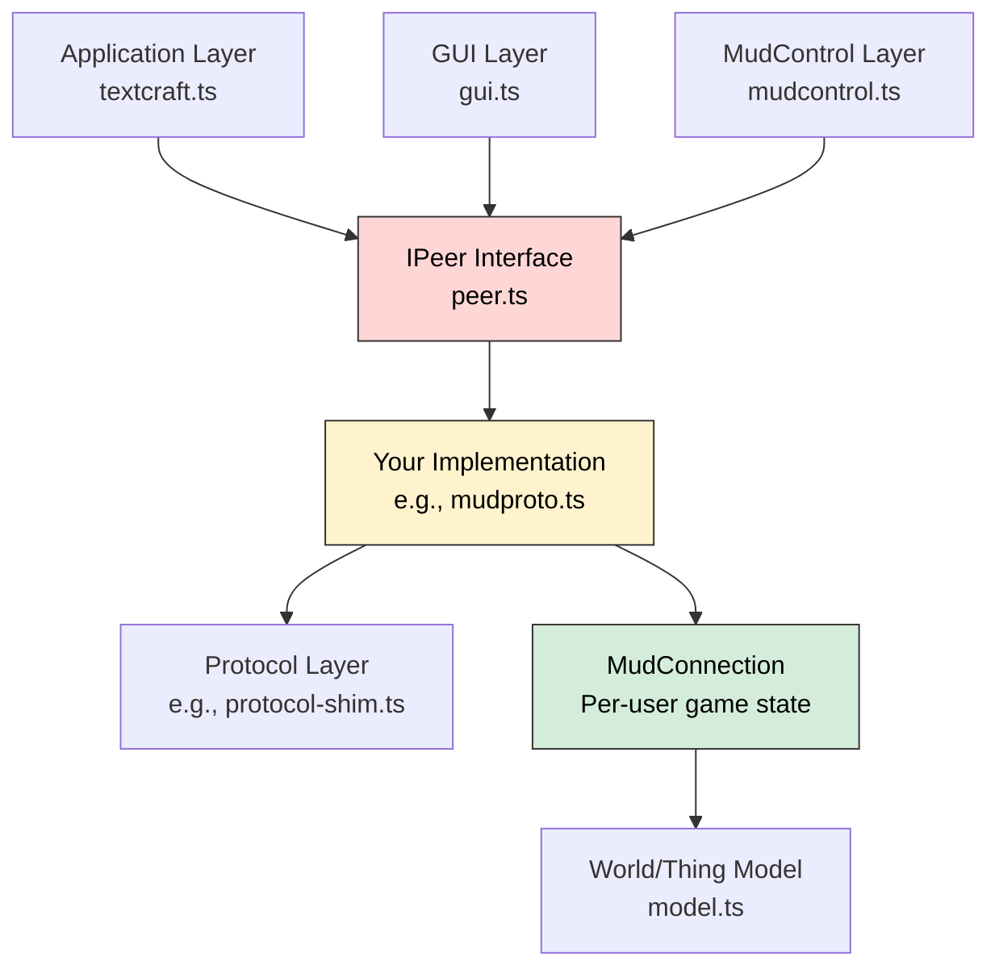
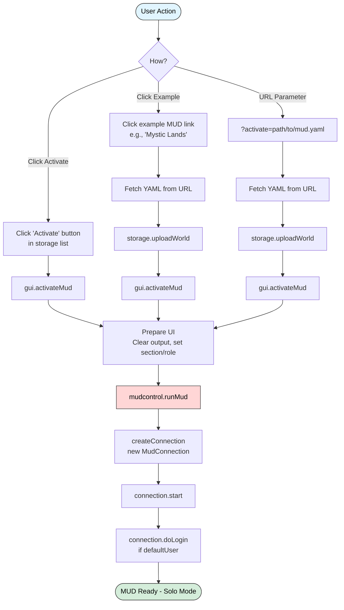
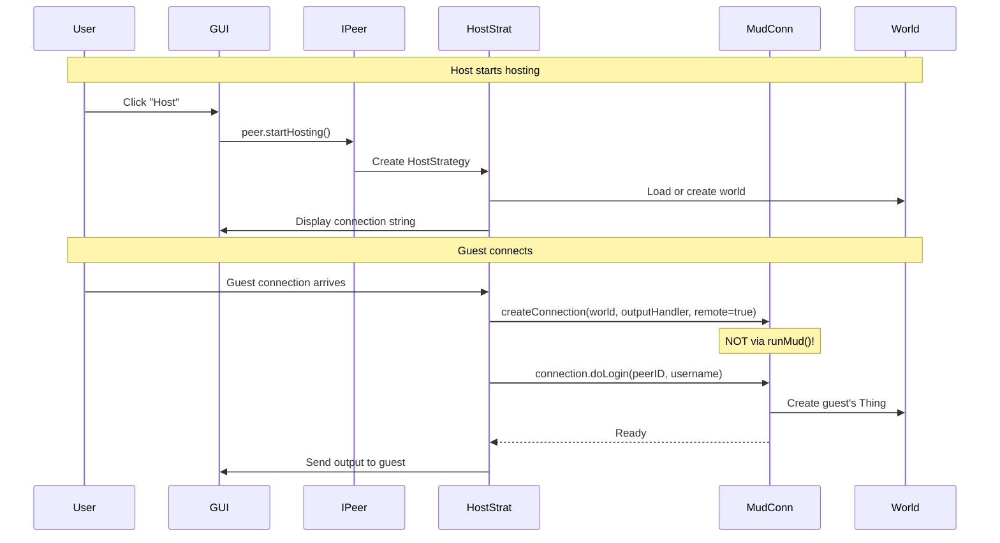
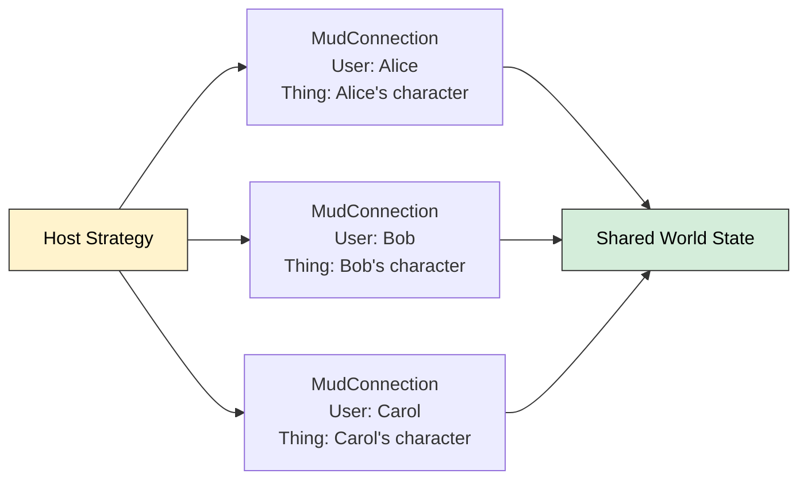
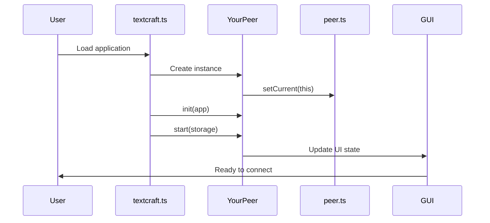
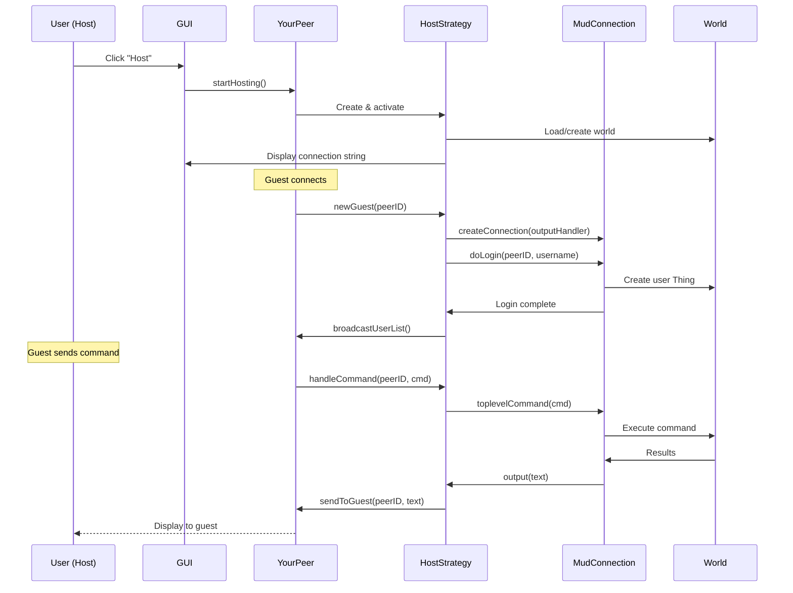
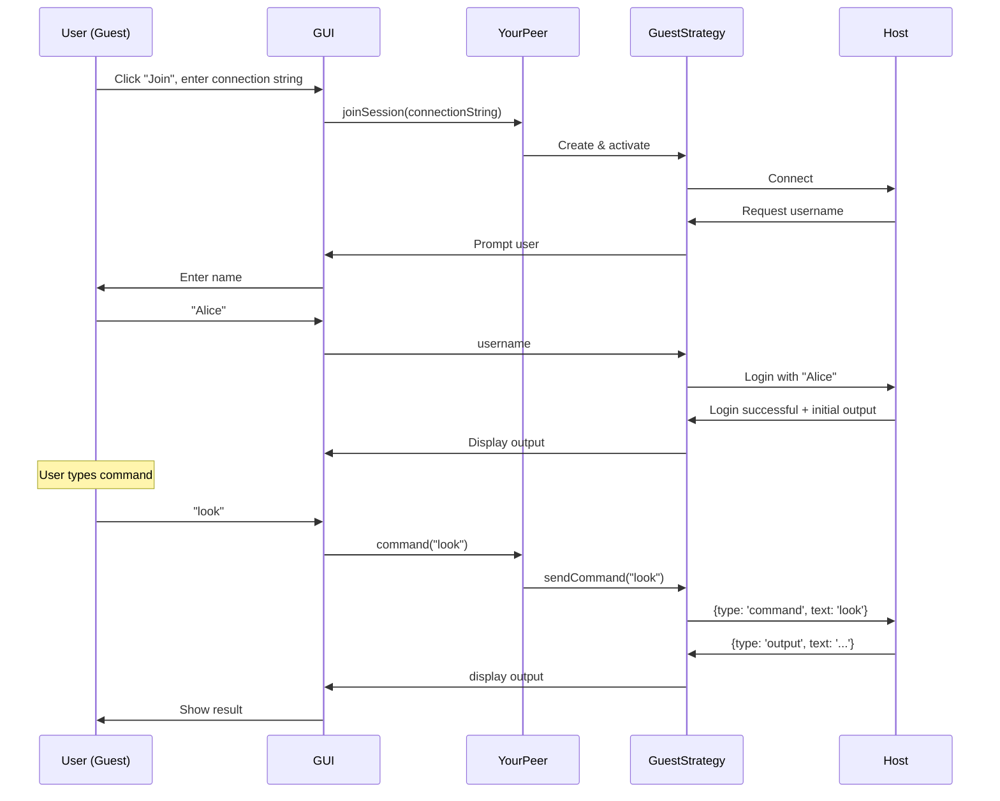
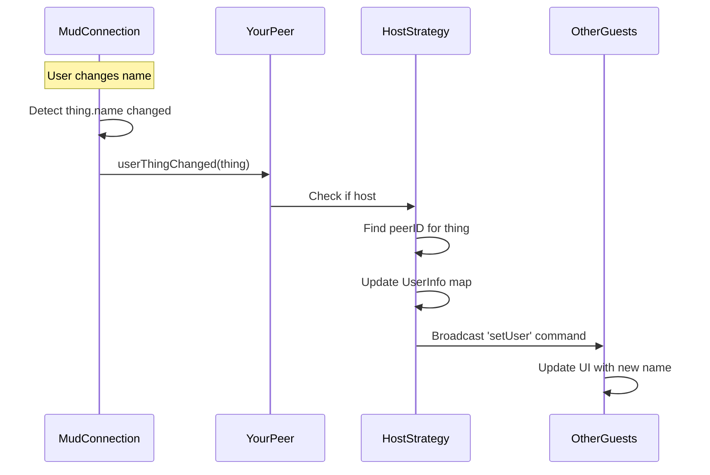

# Developing with Textcraft: Custom Protocol Implementation Guide

This guide shows how to implement your own communication protocol for Textcraft by implementing the `IPeer` interface and properly using `MudConnection`.

## Table of Contents

1. [Architecture Overview](#architecture-overview)
2. [How MUDs Get Started](#how-muds-get-started)
3. [IPeer Interface Implementation](#ipeer-interface-implementation)
4. [MudConnection Integration](#mudconnection-integration)
5. [Complete Implementation Flow](#complete-implementation-flow)
6. [Example: Custom WebSocket Protocol](#example-custom-websocket-protocol)
7. [Testing Your Implementation](#testing-your-implementation)

---

## Architecture Overview

Textcraft uses a three-layer architecture for networking:



### Key Components

- **IPeer**: Abstract interface for P2P networking (defined in `peer.ts`)
- **MudConnection**: Per-user game session manager (defined in `mudcontrol.ts`)
- **Protocol Layer**: Your choice of transport (WebSocket, WebRTC, libp2p, etc.)
- **World/Thing Model**: Shared MUD state (defined in `model.ts`)

---

## How MUDs Get Started

Before diving into custom protocol implementation, it's important to understand how MUDs are initialized in Textcraft. There are two scenarios: **Solo Mode** (single-player) and **Multiplayer Mode** (host/guest via IPeer).

### Solo Mode: Direct MUD Initialization

In solo mode, a MUD starts without any networking. The flow goes directly from the GUI to `mudcontrol.runMud()`:



#### The runMud() Function

`mudcontrol.runMud()` is the key function that initializes a MUD session:

```typescript
// Location: html/ts/mudcontrol.ts:3219-3231
export async function runMud(world: World, handleOutput: (str: string) => void, quiet?: boolean) {
    // 1. Set the active world (global state)
    activeWorld = world

    // 2. Register MudConnection constructor with world
    world.mudConnectionConstructor = MudConnection

    // 3. Create a new MudConnection with output handler
    connection = createConnection(world, handleOutput)

    // 4. Start the connection (initializes MUD, shows welcome)
    await connection.start(quiet)

    // 5. If world has a default user, auto-login
    if (world.defaultUser) {
        await connection.doLogin(world.defaultUser, null, world.defaultUser, true)
    }
}
```

**Key Points:**
- Creates a single `MudConnection` instance for the local user
- The `handleOutput` callback sends text to the GUI
- `connection.start()` displays welcome message and login prompt
- Auto-login happens if `world.defaultUser` is set
- This is **solo mode** - no networking involved

#### User Action Paths

**Path 1: From Storage List**
```
User clicks "Activate" on saved MUD
    ↓
gui.ts:showMuds() creates button
    ↓
gui.ts:activateMud(world)
    ↓
mudcontrol.runMud(world, outputHandler)
```

**Path 2: From Example Link**
```
User clicks "Mystic Lands" example
    ↓
onclick='textcraft.Gui.activateMudFromURL("examples/Mystic%20Lands.yaml")'
    ↓
gui.ts:activateMudFromURL(url)
    ↓
Fetch YAML → storage.uploadWorld → storage.openWorld
    ↓
gui.ts:activateMud(world)
    ↓
mudcontrol.runMud(world, outputHandler)
```

**Path 3: From URL Parameter**
```
Page loads with ?activate=examples/Purgatory.yaml
    ↓
gui.ts:start() parses URL parameters
    ↓
gui.ts:activateMudFromURL(url)
    ↓
Fetch YAML → storage.uploadWorld → storage.openWorld
    ↓
gui.ts:activateMud(world)
    ↓
mudcontrol.runMud(world, outputHandler)
```

### Multiplayer Mode: Through IPeer

In multiplayer mode, IPeer implementations bypass `runMud()` and create `MudConnection` instances directly:



**Key Difference:**
- **Solo mode**: Uses `runMud()` → creates one local MudConnection
- **Multiplayer mode**: Host uses `createConnection()` directly → creates one MudConnection per guest
- Guests don't have MudConnections - they just send commands to the host

#### For Protocol Implementers

When implementing IPeer for multiplayer:

1. **Don't call runMud()** - It's only for solo mode
2. **Create MudConnections manually** using `createConnection()`:
   ```typescript
   import { createConnection, activeWorld } from './mudcontrol'

   const mudcon = createConnection(
     activeWorld,           // The world being hosted
     (text) => {            // Output handler - send to guest
       this.sendToGuest(peerID, text)
     },
     true                   // remote = true (this is a remote user)
   )
   ```

3. **Call doLogin()** after creating the connection:
   ```typescript
   await mudcon.doLogin(peerID, null, username, true)
   ```

4. **Route commands** to the appropriate MudConnection:
   ```typescript
   // When guest sends a command
   const mudcon = this.mudConnections.get(peerID)
   await mudcon.toplevelCommand(commandText)
   // Output automatically sent via the outputHandler
   ```

### Summary: Two Initialization Paths

| Aspect | Solo Mode | Multiplayer Mode |
|--------|-----------|------------------|
| Entry point | `mudcontrol.runMud()` | `createConnection()` directly |
| Triggered by | GUI (Activate button, examples, URL) | IPeer implementation (startHosting) |
| MudConnections | 1 (local user) | 1 per guest (on host side) |
| Output handler | Sends to local GUI | Sends to remote guest via network |
| Use case | Single-player exploration | Host/guest sessions |

Understanding this distinction is crucial for implementing custom protocols - you need to know when to use `runMud()` (never in multiplayer) and when to use `createConnection()` (always for guests in multiplayer).

---

## IPeer Interface Implementation

### Step 1: Define Your Implementation

Create a class that implements the `IPeer` interface:

```typescript
import { IPeer, PeerID, UserInfo, setCurrent } from './peer'
import { Thing, MudStorage } from './model'

class MyCustomPeer implements IPeer {
  currentVersionID: string = '1.0.0'
  versionID: string = '1.0.0'

  // Your protocol-specific state
  private connections: Map<PeerID, any> = new Map()
  private strategy: Strategy | null = null

  init(app: any): void {
    // Initialize with app context
    // Store references to GUI, storage, etc.
  }

  start(storage: MudStorage): void {
    // Start your network stack
    // Begin listening for connections
  }

  reset(): void {
    // Disconnect all peers
    // Clear network state
  }

  // ... implement remaining methods
}
```

### Step 2: Implement Core Methods

#### Connection Management

```typescript
connectString(): string {
  // Return connection info for direct connections
  // Example: "ws://192.168.1.100:8080/session/abc123"
  return this.generateConnectionString()
}

relayConnectString(): string {
  // Return connection info for relay-based connections
  // Example: "ws://relay.example.com:8080/relay/xyz789"
  return this.generateRelayString()
}
```

#### Role Methods

```typescript
startHosting(): void {
  // 1. Create HostStrategy
  this.strategy = new HostStrategy(this)

  // 2. Load or create MUD world
  const world = await loadOrCreateWorld(this.storage)

  // 3. Display connection string to user
  gui.showConnectionString(this.connectString())

  // 4. Start listening for guest connections
  this.listenForConnections()
}

joinSession(session: string): void {
  // 1. Create GuestStrategy
  this.strategy = new GuestStrategy(this)

  // 2. Parse connection string
  const connectionInfo = this.parseConnectionString(session)

  // 3. Connect to host
  await this.connectToHost(connectionInfo)

  // 4. Begin login process
  this.strategy.beginLogin()
}

startRelay(): void {
  // 1. Create RelayStrategy
  this.strategy = new RelayStrategy(this)

  // 2. Start forwarding traffic
  this.beginRelaying()
}

hostViaRelay(sessionID: string): void {
  // 1. Create RelayHostStrategy
  this.strategy = new RelayHostStrategy(this)

  // 2. Connect to relay
  await this.connectToRelay(sessionID)

  // 3. Start hosting through relay
  this.strategy.startHosting()
}
```

#### Command Routing

```typescript
command(cmd: string): void {
  // Guests: Send to host
  if (this.strategy instanceof GuestStrategy) {
    this.sendToHost({ type: 'command', text: cmd })
  }
  // Hosts: Route to appropriate MudConnection
  else if (this.strategy instanceof HostStrategy) {
    this.strategy.routeCommand(cmd)
  }
}

userThingChanged(thing: Thing): void {
  // Only hosts propagate user changes
  if (!(this.strategy instanceof HostStrategy)) return

  // 1. Find peer ID for this thing
  const peerID = this.peerIdForThing(thing)
  if (!peerID) return

  // 2. Update user map
  this.setUser(peerID, new UserInfo(peerID, thing.name))

  // 3. Broadcast to all guests
  this.strategy.broadcastUserUpdate(peerID, thing.name)
}
```

### Step 3: Register Your Implementation

```typescript
// At module initialization
setCurrent(new MyCustomPeer())
```

---

## MudConnection Integration

### Understanding MudConnection

`MudConnection` represents a single user's session in the MUD. Each connected peer (guest) gets their own `MudConnection` instance.



### Creating MudConnections (Host Side)

When a guest connects, create a `MudConnection` for them:

```typescript
import { createConnection, activeWorld } from './mudcontrol'

class HostStrategy {
  mudConnections: Map<PeerID, MudConnection> = new Map()

  async handleNewGuest(peerID: PeerID, connectionID: string) {
    // 1. Create MudConnection with output handler
    const mudcon = createConnection(
      activeWorld,
      (text: string) => {
        // Send output back to guest
        this.sendToGuest(peerID, { type: 'output', text })
      },
      true  // remote = true (this is a remote user)
    )

    // 2. Store connection
    this.mudConnections.set(peerID, mudcon)

    // 3. Begin login process
    await this.loginGuest(peerID, mudcon)
  }

  async loginGuest(peerID: PeerID, mudcon: MudConnection) {
    // 1. Prompt for username
    const username = await this.promptUsername(peerID)

    // 2. Perform login
    await mudcon.doLogin(peerID, null, username, true)

    // 3. Update user tracking
    const userInfo = new UserInfo(peerID, mudcon.thing.name)
    this.userMap.set(peerID, userInfo)

    // 4. Notify all peers about new user
    this.broadcastUserList()
  }
}
```

### Routing Commands (Host Side)

```typescript
class HostStrategy {
  async handleCommand(peerID: PeerID, command: string) {
    // 1. Get the user's MudConnection
    const mudcon = this.mudConnections.get(peerID)
    if (!mudcon) {
      console.error(`No connection for peer ${peerID}`)
      return
    }

    // 2. Execute command
    // toplevelCommand returns a promise with the result
    await mudcon.toplevelCommand(command)

    // Output is automatically sent via the outputHandler
    // we provided in createConnection()
  }
}
```

### Guest Side (No MudConnection)

Guests don't manage `MudConnection` - they just send commands and receive output:

```typescript
class GuestStrategy {
  async sendCommand(command: string) {
    // Send to host
    this.sendToHost({
      type: 'command',
      text: command
    })
  }

  handleOutput(output: string) {
    // Display to user
    gui.output(output)
  }
}
```

---

## Complete Implementation Flow

### Initialization Flow



### Host Flow



### Guest Flow



### User Synchronization Flow



---

## Example: Custom WebSocket Protocol

Here's a minimal WebSocket-based implementation:

### File: `ws-peer.ts`

```typescript
import { IPeer, PeerID, UserInfo, setCurrent } from './peer'
import { Thing, MudStorage } from './model'
import { createConnection, activeWorld, MudConnection } from './mudcontrol'
import * as gui from './gui'

// Simple WebSocket-based peer implementation
class WebSocketPeer implements IPeer {
  currentVersionID: string = '1.0.0'
  versionID: string = '1.0.0'

  private socket: WebSocket | null = null
  private server: any = null  // WebSocket server (if hosting)
  private mudConnections: Map<string, MudConnection> = new Map()
  private isHost: boolean = false
  private hostUrl: string = ''

  init(app: any): void {
    console.log('WebSocketPeer initialized')
  }

  start(storage: MudStorage): void {
    console.log('WebSocketPeer started')
  }

  reset(): void {
    // Close all connections
    if (this.socket) {
      this.socket.close()
      this.socket = null
    }

    if (this.server) {
      this.server.close()
      this.server = null
    }

    // Clean up MudConnections
    for (const mudcon of this.mudConnections.values()) {
      mudcon.close()
    }
    this.mudConnections.clear()

    this.isHost = false
  }

  connectString(): string {
    return this.hostUrl
  }

  relayConnectString(): string {
    return this.hostUrl  // Simple implementation doesn't differentiate
  }

  startHosting(): void {
    this.isHost = true

    // In a real implementation, start a WebSocket server
    // For browser, you'd need a relay server
    this.hostUrl = `ws://localhost:8080/session/${this.generateSessionId()}`

    // Pseudo-code for server
    // this.server = new WebSocketServer({ port: 8080 })
    // this.server.on('connection', (ws, request) => {
    //   this.handleGuestConnection(ws, request)
    // })

    gui.output(`Hosting on: ${this.hostUrl}`)
  }

  joinSession(session: string): void {
    this.isHost = false
    this.socket = new WebSocket(session)

    this.socket.onopen = () => {
      gui.output('Connected to host')
    }

    this.socket.onmessage = (event) => {
      const msg = JSON.parse(event.data)
      this.handleMessage(msg)
    }

    this.socket.onerror = (error) => {
      gui.error(`Connection error: ${error}`)
    }
  }

  startRelay(): void {
    // Simple implementation doesn't support relay
    gui.error('Relay not supported in this implementation')
  }

  hostViaRelay(sessionID: string): void {
    // Simple implementation doesn't support relay
    gui.error('Relay hosting not supported in this implementation')
  }

  userThingChanged(thing: Thing): void {
    if (!this.isHost) return

    // Find which peer owns this thing
    for (const [peerID, mudcon] of this.mudConnections) {
      if (mudcon.thing === thing) {
        // Broadcast user update to all other peers
        this.broadcast({
          type: 'userUpdate',
          peerID,
          name: thing.name
        }, peerID)
        break
      }
    }
  }

  command(cmd: string): void {
    if (this.isHost) {
      // Host executes locally
      // (This happens when host types commands)
      // Use the local MudConnection
    } else {
      // Guest sends to host
      this.send({
        type: 'command',
        text: cmd
      })
    }
  }

  // Helper methods

  private handleGuestConnection(ws: WebSocket, peerID: string) {
    // Create MudConnection for this guest
    const mudcon = createConnection(
      activeWorld,
      (text: string) => {
        ws.send(JSON.stringify({
          type: 'output',
          text
        }))
      },
      true
    )

    this.mudConnections.set(peerID, mudcon)

    // Request username
    ws.send(JSON.stringify({
      type: 'requestUsername'
    }))

    // Handle messages from this guest
    ws.on('message', (data) => {
      const msg = JSON.parse(data.toString())
      this.handleGuestMessage(peerID, msg)
    })
  }

  private async handleGuestMessage(peerID: string, msg: any) {
    const mudcon = this.mudConnections.get(peerID)
    if (!mudcon) return

    switch (msg.type) {
      case 'username':
        await mudcon.doLogin(peerID, null, msg.username, true)
        this.broadcast({
          type: 'userUpdate',
          peerID,
          name: mudcon.thing.name
        })
        break

      case 'command':
        await mudcon.toplevelCommand(msg.text)
        break
    }
  }

  private handleMessage(msg: any) {
    switch (msg.type) {
      case 'output':
        gui.output(msg.text)
        break

      case 'requestUsername':
        const username = prompt('Enter your name:')
        this.send({
          type: 'username',
          username
        })
        break

      case 'userUpdate':
        gui.updateUser(msg.peerID, msg.name)
        break
    }
  }

  private send(msg: any) {
    if (this.socket && this.socket.readyState === WebSocket.OPEN) {
      this.socket.send(JSON.stringify(msg))
    }
  }

  private broadcast(msg: any, excludePeerID?: string) {
    // Send to all connected guests except excluded one
    // Implementation depends on your server setup
  }

  private generateSessionId(): string {
    return Math.random().toString(36).substring(7)
  }
}

// Register implementation
setCurrent(new WebSocketPeer())

export default new WebSocketPeer()
```

### Integration

```typescript
// In textcraft.ts, import your implementation instead of mudproto
import { current as Mudproto } from './ws-peer'  // Instead of './mudproto'

// Rest of initialization stays the same
```

---

## Testing Your Implementation

### Unit Test Checklist

```typescript
describe('MyCustomPeer', () => {
  it('should initialize without errors', () => {
    const peer = new MyCustomPeer()
    peer.init(mockApp)
    peer.start(mockStorage)
  })

  it('should generate valid connection strings', () => {
    const peer = new MyCustomPeer()
    const connStr = peer.connectString()
    expect(connStr).toMatch(/^ws:\/\//)
  })

  it('should create MudConnection for new guests', async () => {
    const peer = new MyCustomPeer()
    peer.startHosting()
    await simulateGuestConnection('peer123')
    expect(peer.mudConnections.has('peer123')).toBe(true)
  })

  it('should route commands to correct MudConnection', async () => {
    const peer = new MyCustomPeer()
    peer.startHosting()
    await simulateGuestConnection('peer123')

    const result = await peer.handleCommand('peer123', 'look')
    expect(result).toContain('You see')
  })

  it('should broadcast user changes', async () => {
    const peer = new MyCustomPeer()
    peer.startHosting()
    const guest1 = await simulateGuestConnection('peer1')
    const guest2 = await simulateGuestConnection('peer2')

    // Change guest1's name
    guest1.thing.name = 'NewName'
    peer.userThingChanged(guest1.thing)

    // guest2 should receive update
    expect(guest2.receivedMessages).toContainEqual({
      type: 'userUpdate',
      peerID: 'peer1',
      name: 'NewName'
    })
  })
})
```

### Integration Testing

1. **Host-Guest Connection**
   ```bash
   # Terminal 1: Host
   npm run dev-host

   # Terminal 2: Guest
   npm run dev-guest
   ```

2. **Multi-User Testing**
   - Connect 3+ guests to one host
   - Verify all guests see each other
   - Test command execution from each guest
   - Verify descripton propagation (events visible to all users in same room)

3. **Edge Cases**
   - Guest disconnects mid-command
   - Host disconnects (should close all guest connections)
   - Name changes
   - Multiple commands in quick succession
   - Large output (e.g., `@dump` command)

### Debugging Tips

1. **Enable Verbose Logging**
   ```typescript
   class MyPeer implements IPeer {
     private debug = true

     private log(...args: any[]) {
       if (this.debug) console.log('[MyPeer]', ...args)
     }

     command(cmd: string) {
       this.log('command:', cmd)
       // ...
     }
   }
   ```

2. **Inspect MudConnection State**
   ```typescript
   // In browser console
   window.textcraft.MudControl.connection.thing  // Current user's Thing
   window.textcraft.MudControl.connection.world  // World state
   window.textcraft.Mudproto  // Your peer instance
   ```

3. **Monitor Network Traffic**
   - Use browser DevTools Network tab
   - Look for WebSocket messages
   - Verify message format and timing

---

## Best Practices

### 1. Error Handling

Always handle connection failures gracefully:

```typescript
async joinSession(session: string) {
  try {
    await this.connect(session)
  } catch (error) {
    gui.error(`Failed to connect: ${error.message}`)
    this.reset()
  }
}
```

### 2. Resource Cleanup

Clean up MudConnections when guests disconnect:

```typescript
handleGuestDisconnect(peerID: string) {
  const mudcon = this.mudConnections.get(peerID)
  if (mudcon) {
    mudcon.close()
    this.mudConnections.delete(peerID)
  }

  // Notify other guests
  this.broadcast({
    type: 'userLeft',
    peerID
  })
}
```

### 3. Version Compatibility

Check versions before allowing connections:

```typescript
handleGuestHandshake(peerID: string, guestVersion: string) {
  if (guestVersion !== this.versionID) {
    this.rejectGuest(peerID, `Version mismatch: expected ${this.versionID}, got ${guestVersion}`)
    return false
  }
  return true
}
```

### 4. Output Buffering

For high-frequency output, buffer and batch:

```typescript
class OutputBuffer {
  private buffer: string[] = []
  private timeout: any = null

  add(text: string, callback: () => void) {
    this.buffer.push(text)

    if (!this.timeout) {
      this.timeout = setTimeout(() => {
        callback(this.buffer.join(''))
        this.buffer = []
        this.timeout = null
      }, 16)  // ~60fps
    }
  }
}
```

---

## Reference Implementation

The reference implementation using libp2p is in `mudproto.ts`. Key patterns to study:

1. **Strategy Pattern** (`Strategy`, `HostStrategy`, `GuestStrategy`, `RelayStrategy`)
2. **Connection Tracking** (`trackingHandler`, `connections` map)
3. **Command Routing** (`commandMessage` handlers)
4. **User Management** (`userMap`, `userChanged`)
5. **World Synchronization** (implicit through shared commands)

---

## Additional Resources

- **IPeer Flow Diagram**: See `ipeer-flow-diagram.md` for detailed flow diagrams
- **Thing Model**: See `architecture.md` for understanding the world model
- **MUD Commands**: See `html/README.md` for complete command reference
- **Protocol Documentation**: See `mudcontrol.md` for protocol details

---

*Generated: 2025-10-18*
