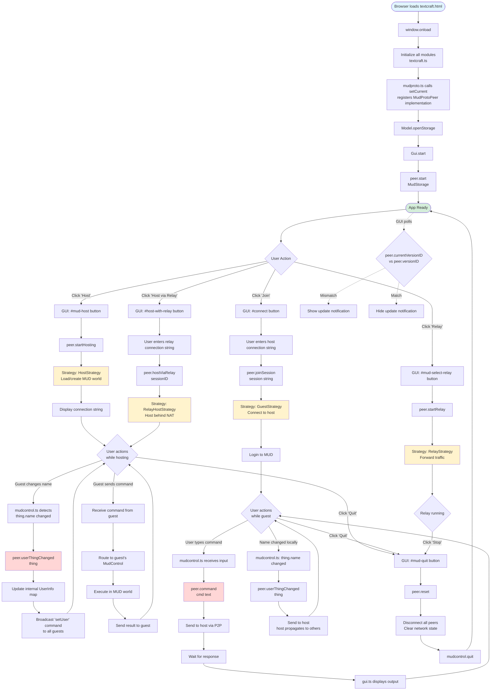
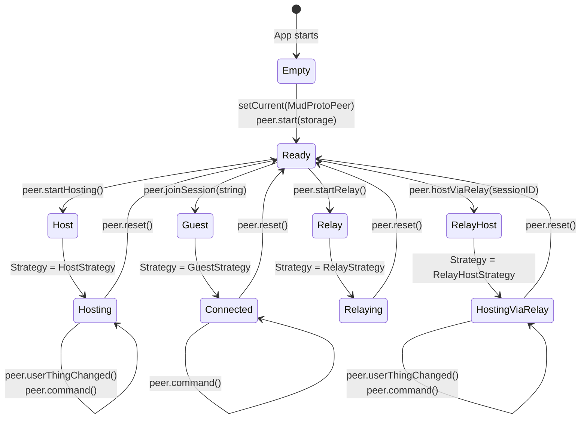

# IPeer Flow Diagram

This diagram shows how the IPeer abstraction is used throughout the Textcraft application, from initialization through various user interactions and P2P operations.

## Application Architecture with IPeer



## Key IPeer Usage Patterns

### 1. Initialization Flow
```
textcraft.ts (entry point)
    ↓
mudproto.ts: setCurrent(MudProtoPeer)
    ↓
peer.current = MudProtoPeer instance
    ↓
All modules can now: import {current as peer} from './peer'
```

### 2. Module Import Pattern
```typescript
// In gui.ts, mudcontrol.ts, etc.
import {current as peer} from './peer'

// Then use directly:
peer.startHosting()
peer.command("look")
peer.userThingChanged(thing)
```

### 3. Host Workflow
```
User clicks "Host" button
    ↓
gui.ts: peer.startHosting()
    ↓
mudproto.ts: Creates HostStrategy
    ↓
Loads MUD from storage OR creates new world
    ↓
Displays connection string to GUI
    ↓
Listens for guest connections
    ↓
When guest connects:
  - Creates MudControl for guest
  - Syncs world state
  - Routes commands bidirectionally
```

### 4. Guest Workflow
```
User clicks "Join" → enters connection string
    ↓
gui.ts: peer.joinSession(connectionString)
    ↓
mudproto.ts: Creates GuestStrategy
    ↓
Connects to host via libp2p
    ↓
Login process (name selection)
    ↓
mudcontrol.ts: All commands go through peer.command()
    ↓
Commands sent to host → executed → results returned
```

### 5. User Synchronization (userThingChanged)
```
mudcontrol.ts detects: this.thing.name !== this.myName
    ↓
peer.userThingChanged(this.thing)
    ↓
mudproto.ts (host only):
  - Looks up peerID for thing
  - Updates UserInfo map: {peerID, newName}
  - Creates 'setUser' command
  - Broadcasts to all guests
  - (Relay mode: also sends to relay server)
    ↓
All peers now see updated username
```

### 6. Command Routing
```
Guest:
  User input → mudcontrol.ts → peer.command(text)
    → Send to host over P2P
    → Host executes
    → Result sent back
    → gui.ts displays

Host:
  Command arrives from guest
    → peer routes to correct guest's MudControl
    → Executes in shared world
    → Results sent to affected peers
```

## State Diagram: Peer Lifecycle



## IPeer Interface Methods - Usage Matrix

| Method | GUI | MudControl | MudProto | Purpose |
|--------|-----|------------|----------|---------|
| `currentVersionID` | ✓ | | ✓ | Version checking for updates |
| `versionID` | ✓ | | ✓ | Expected version comparison |
| `init()` | | | ✓ | App initialization |
| `start()` | | | ✓ | Network startup |
| `reset()` | ✓ | ✓ | | Disconnect & cleanup |
| `connectString()` | ✓ | | ✓ | Show to user for sharing |
| `relayConnectString()` | ✓ | | ✓ | Show for relay connections |
| `startHosting()` | ✓ | | | User clicks "Host" |
| `joinSession()` | ✓ | | | User clicks "Join" |
| `startRelay()` | ✓ | | | User clicks "Relay" |
| `hostViaRelay()` | ✓ | | | User requests relay hosting |
| `userThingChanged()` | | ✓ | | Name changes propagation |
| `command()` | | ✓ | | All MUD command execution |

## Files Involved

- **peer.ts** - IPeer interface definition, singleton export
- **mudproto.ts** - MudProtoPeer implementation, strategies
- **gui.ts** - UI buttons trigger peer operations, version display
- **mudcontrol.ts** - Command routing, user sync via peer
- **textcraft.ts** - Initialization orchestration
- **protocol-shim.ts** - Underlying libp2p abstraction

---

*Generated: 2025-10-18*
